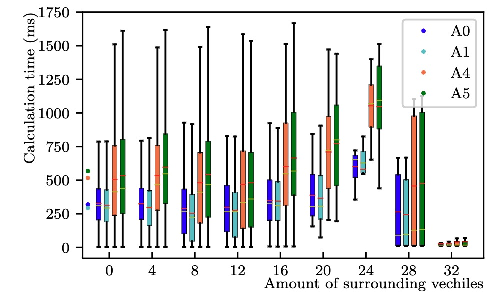
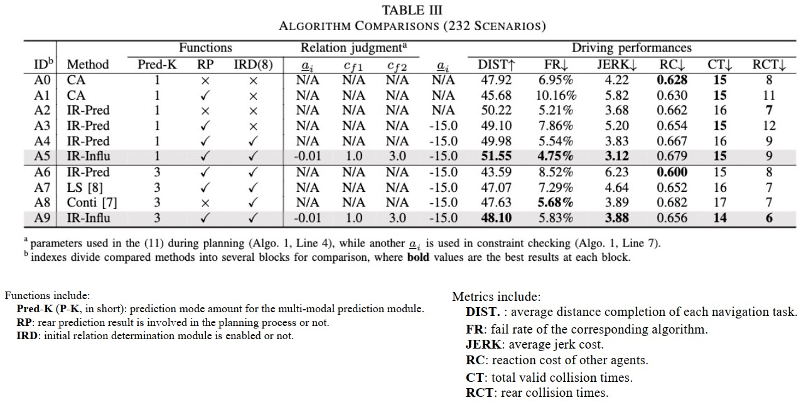
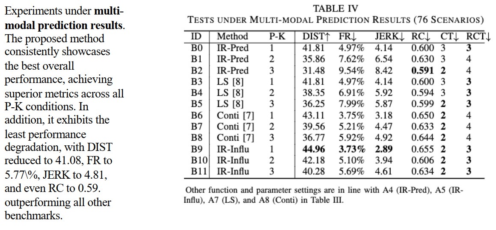
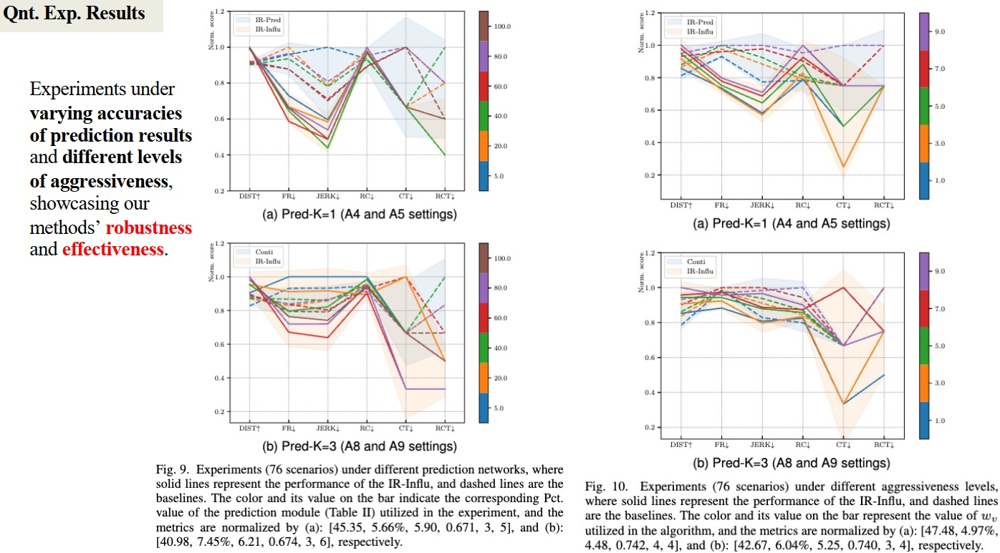

# IR-STP: Enhancing Autonomous Driving with Interaction Reasoning in Spatio-Temporal Planning

<h3 align="center">
  <a href="https://arxiv.org/abs/2311.02850">arxiv</a> | <a href="https://github.com/ChenYingbing/IR-STP-Planner">web</a>
</h3>
**ABSTRACT**: Considerable research efforts have been devoted to the development of motion planning algorithms, which form a cornerstone of the autonomous driving system (ADS). Nonetheless, acquiring an interactive and secure trajectory for the ADS remains challenging due to the complex nature of interaction modeling in planning. Modern planning methods still employ a uniform treatment of prediction outcomes and solely rely on collision-avoidance strategies, leading to suboptimal planning performance. To address this limitation, this paper presents a novel prediction-based interactive planning framework for autonomous driving. Our method incorporates interaction reasoning into spatio-temporal (s-t) planning by defining interaction conditions and constraints. Specifically, it records and continually updates interaction relations for each planned state throughout the forward search. We assess the performance of our approach alongside state-of-the-art methods in the CommonRoad environment. Our experiments include a total of 232 scenarios, with variations in the accuracy of prediction outcomes, modality, and degrees of planner aggressiveness. The experimental findings demonstrate the effectiveness and robustness of our method. It leads to a reduction of collision times by approximately 17.6% in 3-modal scenarios, along with improvements of nearly 7.6% in distance completeness and 31.7% in the fail rate in single-modal scenarios. For the community's reference, our code is accessible at https://github.com/ChenYingbing/IR-STP-Planner.


## Content List:

1. [Introduction](#intro)
2. [Exprimental results](#exp_result) 
3. [News](#news)
4. [Getting Started](#tutorials)


## Introduction <a name="intro"></a>

Our approach integrates **interaction modeling** into s-t planning by recording and updating interaction relationships for every planned state throughout the planning process. More specifically, the interaction relationships are modified through forward search, guided by the interaction formulations we put forth. These formulations clarify appropriate interaction dynamics, encompassing reactions (e.g., overtaking and yielding), and delineate strategies to influence the trajectories of other agents, providing guidance on the timing and execution of these actions.

**Simulation Verification**: The proposed planning method is validated under prediction results from pgp-network [1] in Commonroad [2] closed-loop simulation. 

**BibTex**: If you find this repository useful, please consider giving us a star 🌟 and citing it by

```bibtex
@article{chen2023ir,
  title={IR-STP: Enhancing Autonomous Driving with Interaction Reasoning in Spatio-Temporal Planning},
  author={Chen, Yingbing and Cheng, Jie and Gan, Lu and Wang, Sheng and Liu, Hongji and Mei, Xiaodong and Liu, Ming},
  journal={arXiv preprint arXiv:2311.02850},
  year={2023}
}
```

## Experimental Results <a name="exp_result"></a>

Below show part of experimental results, for more details, pls see <a href="https://arxiv.org/abs/2311.02850">arxiv</a>. 

### Qualitative Results


<p float="left">
   
   
</p>

Red box: ego vehicle;

Yellow line (left): the reference route;

Blue points (left): the planned trajectory;

dotted lines (right): multi-modal prediction results;

### Quantitative Results

- Calculation Times (in Python)
 
   

- Compared with Benchmarks

   

  ***
   

  ***
   

## News <a name="news"></a>

- 15/01/2024 Accepted by IEEE T-ITS.
- 07/11/2023 Initialize paper link
- 15/08/2023 Submitted.
- 28/07/2023 Initialization.

The code and tutorial have been released, any questions or inquiries are welcomed.


## Getting Started <a name="tutorials"></a>

Code includes
1. Training/Evaluation codes of pgp prediction networks implemented in Commonroad Env.
2. The proposed IR-STP planning method.
3. Evaluation tools Commonroad Env., including solution caching as well as metric extraction.

Tutorials see documentation [./docs/tutorial.md](./docs/tutorial.md).


**References:**

[1] Deo N, Wolff E, Beijbom O. Multimodal trajectory prediction conditioned on lane-graph traversals[C]//Conference on Robot Learning. PMLR, 2022: 203-212.

[2] Althoff M, Koschi M, Manzinger S. CommonRoad: Composable benchmarks for motion planning on roads[C]//2017 IEEE Intelligent Vehicles Symposium (IV). IEEE, 2017: 719-726.

[6] Cui A, Casas S, Sadat A, et al. Lookout: Diverse multi-future prediction and planning for self-driving[C]//Proceedings of the IEEE/CVF International Conference on Computer Vision. 2021: 16107-16116.

[21] Pan Y, Lin Q, Shah H, et al. Safe planning for self-driving via adaptive constrained ILQR[C]//2020 IEEE/RSJ International Conference on Intelligent Robots and Systems (IROS). IEEE, 2020: 2377-2383.


