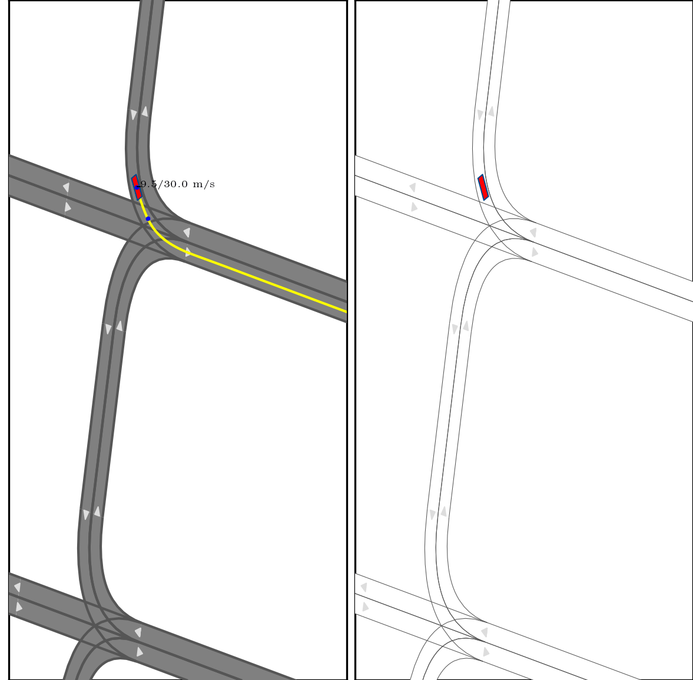

# IR-STP: Enhancing Autonomous Driving with Interaction Reasoning in Spatio-Temporal Planning

<h3 align="center">
  <a href="https://arxiv.org/abs/2311.02850">arxiv</a> | <a href="https://github.com/ChenYingbing/IR-STP-Planner">web</a>
</h3>
**ABSTRACT**: Considerable research efforts have been devoted to the development of motion planning algorithms, which form a cornerstone of the autonomous driving system (ADS). Nonetheless, acquiring an interactive and secure trajectory for the ADS remains challenging due to the complex nature of interaction modeling in planning. Modern planning methods still employ a uniform treatment of prediction outcomes and solely rely on collision-avoidance strategies, leading to suboptimal planning performance. To address this limitation, this paper presents a novel prediction-based interactive planning framework for autonomous driving. Our method incorporates interaction reasoning into spatio-temporal (s-t) planning by defining interaction conditions and constraints. Specifically, it records and continually updates interaction relations for each planned state throughout the forward search. We assess the performance of our approach alongside state-of-the-art methods in the CommonRoad environment. Our experiments include a total of 232 scenarios, with variations in the accuracy of prediction outcomes, modality, and degrees of planner aggressiveness. The experimental findings demonstrate the effectiveness and robustness of our method. It leads to a reduction of collision times by approximately 17.6% in 3-modal scenarios, along with improvements of nearly 7.6% in distance completeness and 31.7% in the fail rate in single-modal scenarios. For the community's reference, our code is accessible at https://github.com/ChenYingbing/IR-STP-Planner.


## Content List:

1. [News](#news)
2. [Code Content](#contentlist)
3. [Tutorials](#tutorials)


## News <a name="news"></a>

- 15/01/2024 Accepted by IEEE T-ITS.
- 07/11/2023 Initialize paper link
- 15/08/2023 Submitted.
- 28/07/2023 Initialization.


The code and tutorial have been released, any questions or inquiries are welcomed.


## Code Content <a name="contentlist"></a>

- Training/Evaluation codes of pgp prediction networks implemented in Commonroad Env.
- The proposed IR-STP planning method in a s-t serach framework.
- Evaluation tools Commonroad Env., including solution caching as well as metric extraction.


If you find this work useful, pls cite 
```
Chen Y, Cheng J, Gan L, et al. IR-STP: Enhancing Autonomous Driving with Interaction Reasoning in Spatio-Temporal Planning[J]. arXiv preprint arXiv:2311.02850, 2023.
```

# Tutorials <a name="tutorials"></a>
## 1 Installation

The following commands were checked in Python3.8.

- Create a conda environment and activate it.

  ```
  conda create -n your_conda_env python=3.8
  conda activate your_conda_env
  ```


- Install repositories & dependencies.

  ```
  ./install.sh
  ```

  Then, the following repositories & their dependencies will be automatically installed:

  ```
  1. commonroad
  2. commonroad-interactive-scenarios
  ```
  
  @note if it is your first time to install **sumo**, it is required to reboot the computer. For details, please see README.md in **thirdparty/commonroad-interactive-scenarios**.
  

  where, sumo (commonroad-interactive-scenarios requires) needs to be manually installed

  ```
  sudo apt install sumo
  ```

- manually install pytorch in your conda env

  for example (corresponding to **nvcc --version**: release 11.3)
  
  ```
  conda install pytorch torchvision torchaudio tensorboard cudatoolkit=11.3 -c pytorch
  ```


## 2 Preparation & Examinations

- **vscode setting.json**: the following settings will enable code autocompletion in **vscode**.

  ```
  "your/path/to/this_repository/scripts/thirdparty/commonroad_io/",
  "your/path/to/this_repository/scripts/thirdparty/commonroad-interactive-scenarios/",
  "your/path/to/this_repository/scripts/thirdparty/kmeans_pytorch/",
  ```


- Prepare the **yaml files**:

  - copy the following files (\*.yaml.example), 
  - modify its content,
  - and rename them as (\*.yaml)
  
  
  ```
  scripts/conf/config.yaml.example
  ```
  
  where, the variables follow:
  1. **COMMONROAD_DATA_ROOT**
  
     The path to store the commonroad-scenarios/
  
     https://gitlab.lrz.de/tum-cps/commonroad-scenarios.
  
     The file structure looks like:
  
     ```
     commonroad/
     └── commonroad-scenarios/
     ```


## 3 How to use

First step is to activate the conda env

```
conda activate your_conda_env
```


### 3.1 Test of third-party interafces

Normal test, test the availabilities of third-parties. 

```
python3 scripts/tests/test_thirdparty_interfaces.py
```


### 3.2 Generate scenarios from commonroad-sumo simulation

This step will generate scenario (-T) files in **EXP_ROOT/commonroad/simulated_scenarios** folder by using commonroad-sumo interface to simulate the (-I) scenarios.


Run

```
python scripts/extract_commonroad_scenarios_from_simu.py
```

- Tip1: this step offers training/validation data used to train/validate the prediction models.
- Tip2: In commonroad, scenario with (-T) is with true values, (-I) is for simulation, (-S) is with set-based prediction, and so on. For more details, please check https://commonroad.in.tum.de.


To configure where to read scenario.xml files for simulation, please see:

```
envs.commonroad.simulation.config.py

	SCENE_DIRS = []
```


### 3.3 Extract data for training prediction network

This step is to extract prediction train/eval torch.tensor files from commonroad scenario.xml files for training the prediction network.  

Run the following command:

```
python scripts/process_datasets.py --dataset commonroad --process prediction --num_workers 10
```

It will generate data for training prediction module, and the results will be stored at **EXP_ROOT/commonroad/prediction/** folder.

example pgp training data like:


The following **yaml** file is used in configuring the vectorization & graph:

```
envs/conf/preprocess_dataset_config.yaml
```

And the following **json** files are used in configuring the raster image:

```
envs/commonroad/conf/focused_dyn_obst_params.json # configs for target agent
envs/commonroad/conf/raster_params.json # configs for other dynamic agents
```


### 3.4 Train & Evaluate prediction models

#### 1) Training

After complete **c. Extract data for training prediction network**, run the following commands to train a prediction model. 

*Tips*: we have tested mtp and covernet networks from **Nuscenes devkit**, and the prediction result is not good as pgp prediction networks.


Run the following command to train the pgp network:

```
python scripts/train_prediction_model.py -c ./scripts/envs/conf/net_pgp_gatx2_lvm_traversal.yml -m pgp_lvm_trav -n 200
```

where, the network structure / training parameters are configured at **net_pgp_gatx2_lvm_traversal.yml**, "-m" denotes the model folder name being saved, and "-n" denotes the num_epochs. The trained model is saved at **EXP_ROOT/${dataset}/models/**,

where, configuration file and the checkpoint files are automatically stored

```
./
├── checkpoints
├── config.yaml
└── tensorboard_logs
```

More configurations can be found at 

```
scripts/envs/conf/prediction_train_config.yaml:

commonroad: 
  # Which mode to excute
  #   1. extract: extract data from dataset ('data_path').
  #   2. load: try load data from 'save_path'.
  # @note data_path and save_path are defined in process_dataset.py
  mode: 'load'
  version: 'train'
  # Percentage of data being loaded in the train
  full_loaded: 0.05
```

#### 2) Evaluating and comparing trained models

Run the following command,

```
python scripts/eval_prediction_models.py -m /your/EXP_ROOT/commonroad/models/
```

And all trained prediction models will be evaluated and compared, example result like

```
[100.0%]: [8]min_ade_5: 0.79, [8]min_ade_10: 0.59, [12]min_ade_10: 1.17, [8]miss_rate_5: 0.26, [8]miss_rate_10: 0.15, [12]miss_rate_10: 0.44, pi_bc: 2.52, ;

[80.0%]: [8]min_ade_5: 0.83, [8]min_ade_10: 0.62, [12]min_ade_10: 1.21, [8]miss_rate_5: 0.27, [8]miss_rate_10: 0.17, [12]miss_rate_10: 0.48, pi_bc: 2.42, ;

[60.0%]: [8]min_ade_5: 0.81, [8]min_ade_10: 0.61, [12]min_ade_10: 1.20, [8]miss_rate_5: 0.25, [8]miss_rate_10: 0.16, [12]miss_rate_10: 0.46, pi_bc: 2.58, ;

[50.0%]: [8]min_ade_5: 0.84, [8]min_ade_10: 0.64, [12]min_ade_10: 1.26, [8]miss_rate_5: 0.26, [8]miss_rate_10: 0.16, [12]miss_rate_10: 0.48, pi_bc: 2.62, ;

[40.0%]: [8]min_ade_5: 0.86, [8]min_ade_10: 0.65, [12]min_ade_10: 1.25, [8]miss_rate_5: 0.29, [8]miss_rate_10: 0.17, [12]miss_rate_10: 0.52, pi_bc: 2.57, ;

[30.0%]: [8]min_ade_5: 0.90, [8]min_ade_10: 0.69, [12]min_ade_10: 1.35, [8]miss_rate_5: 0.29, [8]miss_rate_10: 0.18, [12]miss_rate_10: 0.52, pi_bc: 2.85, ;

[20.0%]: [8]min_ade_5: 0.94, [8]min_ade_10: 0.72, [12]min_ade_10: 1.44, [8]miss_rate_5: 0.30, [8]miss_rate_10: 0.19, [12]miss_rate_10: 0.54, pi_bc: 2.76, ;

[10.0%]: [8]min_ade_5: 1.04, [8]min_ade_10: 0.79, [12]min_ade_10: 1.57, [8]miss_rate_5: 0.36, [8]miss_rate_10: 0.22, [12]miss_rate_10: 0.60, pi_bc: 2.88, ;

[5.0%]: [8]min_ade_5: 1.25, [8]min_ade_10: 0.94, [12]min_ade_10: 1.83, [8]miss_rate_5: 0.40, [8]miss_rate_10: 0.26, [12]miss_rate_10: 0.66, pi_bc: 3.01, ;
```

where, the [percentage %] means how much percentage of data are used in trainning.


### 3.5 Closed-loop simulation with planner

```
python scripts/planning_commonroad.py --model_path /your/EXP_ROOT/$dataset$/models/your_prediction_model_name_folder --check_point best --create_video 1
```

- --model_path: the path to the prediction model being applied during closed-loop simulation

- --check_point: the check point tag of the prediction model

- --create_video: int = 1 (enable), = 0 (disable); enable create pictures in **EXP_ROOT/commonroad/exp_plan/videos/${tag_str}** or not, 

  where "tag_str" is defined as **solu_tag_str** in scripts/conf/planning_commonroad.yaml.
  
  **Note**: create_video == 1, requires that the latex is supported in your environment. To disable latex, comment the following code in *scripts/paper_plot/utils.py*:
  
  ```
  modify 
  	plt.rc('text', usetex=True) 
  as
  	plt.rc('text', usetex=False)
  ```

Example **sh** and more details are shown in ./sh/_run_IR-STP_example.sh

Tips: Core codes are located at *./scripts/planenrs/st_search/zone_stv_search_xxx*. 


During simulations, files of result scenarios and created in **EXP_ROOT/${dataset}/exp_plan/**, including

```
EXP_ROOT/${dataset}/exp_plan/result_scenarios/${tag_str}

EXP_ROOT/${dataset}/exp_plan/solutions/${tag_str}

EXP_ROOT/${dataset}/exp_plan/videos/${tag_str}
```

An example of video is:




@note Prediction module in the simulation uses the configurations in **envs/conf/preprocess_simu_config.yaml**. 


### 3.6 Evaluate closed-loop simulation performance

After finish simulation, run

```
python scripts/eval_commonroad_solutions.py
```

Which will evaluate solutions with [tag_str, ...] in scripts/conf/eval_tags.yaml, e.g., 

```
eval_config:
  eval_tags: [
    'method_ca_0.1_p1', 
    'method_ca_0.3_p1', 
    'method_ca_0.6_p1', 
    'method_ca_1.0_p1'
  ]
```

And the performance metrics and records will be stored at **EXP_ROOT/commonroad/exp_plan/evals/{tag_str}$** for further visualization.
